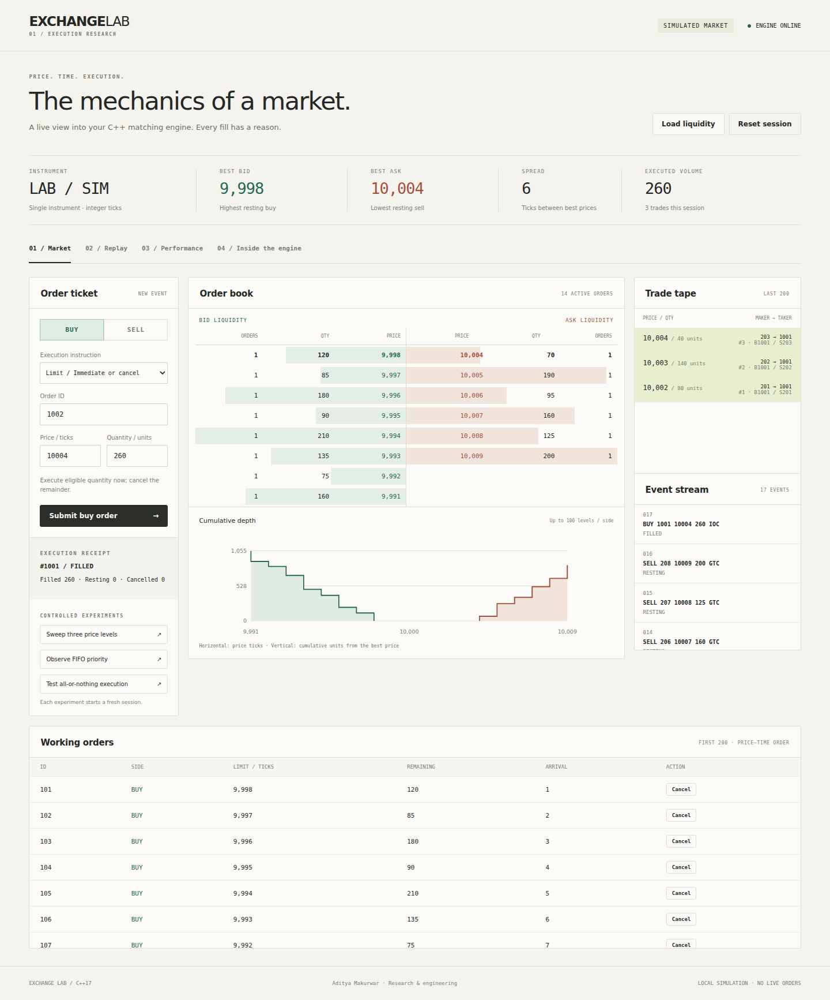

# ExchangeLab
### C++ matching engine · market replay · execution dashboard

A local exchange simulator built to make execution rules inspectable. A C++17 engine handles every fill; a Python standard-library bridge serves a dependency-free browser dashboard. There is no live exchange connection and no third-party data feed.



## Start on your Mac

1. Extract the ZIP and open the **ExchangeLab** folder in VS Code.
2. Open Terminal in that folder and run:

```bash
bash START_HERE.command
```

The launcher builds three C++ programs, runs the correctness suite, starts the local server and opens **http://127.0.0.1:8765**. Keep that terminal open. Stop with **Ctrl+C**.

Requirements: a C++17 compiler (`clang++` on Mac, `g++` on Linux) and Python 3. No pip/npm dependencies. If the Mac compiler is missing, run `xcode-select --install` and finish the system installer. Python 3 must also be available as `python3`. No `std::from_chars` is used.

If port 8765 is occupied:

```bash
bash START_HERE.command --port 8766
```

Build/test separately:

```bash
bash scripts/build.sh
./build/test_engine
python3 tests/test_server.py
python3 server.py
```

The shell build is the simplest route. Optional CMake:

```bash
cmake -S . -B build -DCMAKE_BUILD_TYPE=Release
cmake --build build
ctest --test-dir build --output-on-failure
python3 server.py
```

## What to try first

1. Click **Load liquidity**. You get 16 synthetic resting orders.
2. Submit `BUY`, ID `1001`, limit `10004`, quantity `260`, type `IOC`.
3. Observe three executions: 80 units at 10002, 140 at 10003, 40 at 10004. The third ask retains 70 units.
4. Cancel a working order using its row button.
5. Try the **FIFO** and **FOK** controlled experiments. Each replaces the session.
6. Open **Replay**, load the example and use Step or Play. Observe the Market tab while it runs.
7. Export the event journal, load it back, and replay to the end. The final book and trade history match.
8. Open **Performance** and run a benchmark on your own machine. Download the results JSON.

## Features

- Price-time priority: ordered price levels and FIFO order queues.
- Best bid/ask, aggregate depth, spread, working orders and executed trades.
- Limit GTC, limit IOC, limit FOK and unpriced immediate market orders.
- Partial fills, sweeps across price levels, cancellation and duplicate-ID rejection.
- FOK liquidity precheck before any execution; no partial FOK trades.
- Deterministic text-event replay and manual journal export/import.
- Actual C++ engine results in the dashboard; no fabricated fills or performance values.
- Independent vector reference model and 20,000 randomized differential events.
- Local comparison benchmarks with warm-up, p50/p95/p99 and throughput.
- GitHub Actions configuration for Linux and macOS build/test runs.

## Rules and limits

| Rule | Behaviour |
|---|---|
| Instrument | One synthetic instrument, LAB / SIM |
| Price | Integer ticks; no currency conversion implied |
| Quantity | Positive integer units |
| Priority | Better price first, then engine-assigned sequence |
| Execution price | Resting (maker) order's price |
| GTC | Unfilled remainder joins book |
| IOC | Fill eligible quantity now; cancel remainder |
| FOK | Entire quantity immediately or zero trades; cancelled attempt consumes ID |
| Market | Consume available opposite liquidity; cancel any remainder |
| IDs | 1..9,007,199,254,740,991; never reused within session |
| Price/quantity maximum | 1,000,000,000 each; market price field must be zero |
| Engine capacity gate | At most 1,000,000 accepted IDs and 100,000 active orders per session; submissions reject once a gate is reached |
| UI limits | First 100 levels/side, first 200 active orders, last 200 trades, last 100 events |
| Replay | Up to 5,000 commands and 256KB request payload; exports may exceed this after large sessions |
| Dashboard interactive log | Up to 10,000 events before reset is required |

The ladder displays eight levels/side; the depth chart uses up to 100. BOOK JSON has bounded display lists. The internal engine still maintains all active orders up to its capacity gate. Import/export is a manual reproducibility feature, not automatic crash recovery. A reset starts a new session and permits ID reuse.

## Files

```text
include/engine.hpp       Price maps, FIFO queues, ID index, matching rules
include/protocol.hpp     Strict integer parser, commands and JSON snapshots
src/main.cpp            Engine CLI / JSON line protocol / replay
src/benchmark.cpp       Reproducible benchmark harness
tests/reference.hpp    Independent vector reference implementation
tests/test_engine.cpp  Deterministic and randomized correctness checks
tests/test_server.py   HTTP, journal replay and endpoint integration checks
server.py               Local-only HTTP bridge to persistent C++ process
web/                    Browser dashboard, no external assets/dependencies
data/                   Synthetic liquidity, scenarios and replay commands
docs/                   Architecture, Hinglish learning guide and verification
scripts/build.sh        clang++ / g++ build script
START_HERE.command      Mac-friendly build, test and launch entrypoint
```

## Command protocol

```text
BUY 1 9998 60 GTC
SELL 2 10002 40 GTC
BUY 3 10002 70 IOC
SELL 4 0 10 MARKET
BUY 5 10003 80 FOK
CANCEL 1
BOOK
RESET
QUIT
```

Run `./build/exchange --json` and enter commands; one JSON response per command. Replay:

```bash
./build/exchange --replay data/replay.txt
```

UI and replay use exactly the same C++ command handler. Rejected input is included in the journal and reproduces as a rejection. Comments beginning with `#` are ignored.

## Benchmark responsibly

```bash
./build/benchmark > benchmark-local.json
```

Read [benchmark methodology](docs/BENCHMARKS.md). Results depend on workload, compiler and machine. The optimized engine also maintains extra depth/index/history bookkeeping compared with the reference. There is **no** promised speedup or production latency claim. The dashboard records compiler, flags, OS and machine when it runs the benchmark.

## Engineering scope

Educational/portfolio simulator, not a production venue: single engine thread, one instrument, volatile state, no network feed, accounts, fees, self-trade prevention, exchange-specific market collars, risk checks or transactional recovery from allocation failures. Do not expose the local Python server publicly. Local session/token checks protect browser commands; this is not a multi-user authentication system. Use one controlling browser tab; it renders after actions rather than synchronizing all open tabs.

See [architecture](docs/ARCHITECTURE.md), [learning guide](docs/LEARNING_GUIDE.md) and [verification](docs/VERIFICATION.md).

## GitHub presentation

Suggested repository: **exchangelab-cpp**.

Suggested description: “C++17 price-time matching engine with FIFO price levels, IOC/FOK orders, deterministic replay, differential tests and a live local dashboard.”

Upload this folder's source and documentation, including the screenshot. `.gitignore` excludes binaries and build output. Before publishing, run the tests on your Mac and report only measured benchmark results. CI configuration is included; successful hosted CI runs depend on pushing it to your repository.

Project author: **Aditya Makurwar**. Developed with AI assistance; review the walkthrough and own the design decisions before representing technical understanding in interviews.
